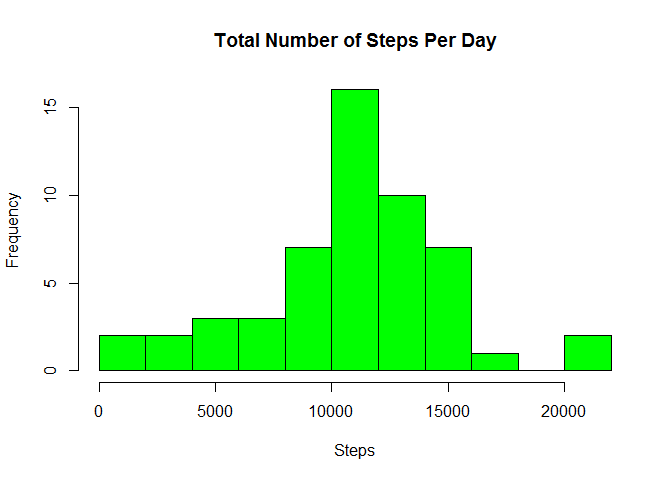
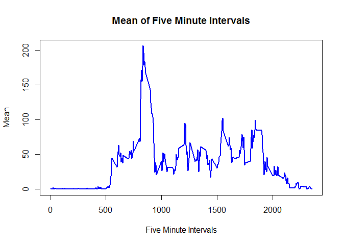

# Reproducible Research: Peer Assessment 1

This analysis uses data from a personal activity monitoring device. This device collects data at 5 minute intervals through out the day. The data consists of two months of data from an anonymous individual collected during the months of October and November, 2012 and include the number of steps taken in 5 minute intervals each day.

The **datafile** consists of 3 variables.

**steps**:    Number of steps taking in a 5-minute interval (missing values
              are coded as NA)  

**date**:     The date on which the measurement was taken in YYYY-MM-DD format  

**interval**: Identifier for the 5-minute interval in which measurement was
              taken  

####Step 0 - Housekeeping  


```r
### setwd("~/RWD")
library(plyr)
```

```
## Warning: package 'plyr' was built under R version 3.1.3
```

```r
library(lattice)
### Set output number format - This is for displaying variables 
### in-line with text, e.g. mean and median.
options(scipen = 1, digits = 0)
```

  
####Step 1 - Load the data and change date variable to date format
  

```r
    activity_data <- read.csv('activity.csv')
    
    activity_data$date <- as.Date(activity_data$date, format = "%Y-%m-%d")
```
  
####Step 2 -  What is mean total number of steps taken per day?
              

```r
### Remove rows with missing data - NA
    activity_data_comp <- activity_data[complete.cases(activity_data), ]

### Summarize by date into new DF
    stepdata <- ddply(activity_data_comp, 'date', summarise,
                 total_steps = sum(steps) )
```
  
#####Create Histogram of the total number of steps per day.
  

```r
### Plot histogram - breaks = 10 gives finer plot
    hist(stepdata$total_steps,
            main = "Total Number of Steps Per Day Histogram",
            xlab = "Steps",
            col="green",
            breaks=10)
```

 
  
#####Calculate Mean and Median of Total Steps Per Day
  

```r
    stepmean <- mean(stepdata$total_steps)
    stepmedian <- median(stepdata$total_steps)
```

  
The mean is 10766 and the median is 10765.


#### Step 3 - What is the average daily activity pattern?


```r
### Average the Intervals across days into new DF
    intervaldata <- ddply(activity_data_comp, 'interval', summarise,
                 mean_steps = mean(steps) )
```

##### Plot of Mean Number of Steps Per 5 Minute Interval


```r
### Create Line plot
    plot(intervaldata, type = 'l',
                      xlab = "5 Minute Intervals",
                      ylab = "Mean",
                      col = "blue",
                      lwd = 2 )
```

 

```r
### Find the interval with maximum mean
    
    max_interval <- intervaldata[which.max(intervaldata$mean_steps),1]
```


The interval with maximum mean steps is 835


#### Step 4 - Imputing missing values 

##### We will use the interval mean from Step 3 to replace missing values


```r
### Count missing values (NA)
    missing <- sum(is.na(activity_data))
```

There are 2304 missing values in the dataset.

##### Replace missing Values


```r
### Create DF with only the NA rows
    missing_data <- activity_data[is.na(activity_data),]
### merge NA rows with the interval means from Step 3
    temp <- merge(missing_data, intervaldata, by = "interval")
### replace steps with mean
    temp$steps <- temp$mean_steps
### drop the mean column
    temp$mean_steps <- NULL
### append imputed missing values to the DF from Step 1 that did not include the NA rows
    activity_data_imputed = rbind(activity_data_comp, temp)
```

##### Create Histograms comparing with and without missing values


```r
### Summarize steps by date
    stepdata_imputed <- ddply(activity_data_imputed, 'date', summarise,
                 total_steps = sum(steps) )
### Plot

    par(mfrow=c(1,2))

### Without missing data - Use ylim to get same scale for both plots
    hist(stepdata$total_steps,
            main = "Without NA Data",
            xlab = "Steps",
            ylim = c(0,25),
            col="green",
            breaks=10)

### Histogram with Imputed Values
    hist(stepdata_imputed$total_steps,
            main = "NA Data replaced by Mean",
            xlab = "Steps",
            ylim = c(0,25),
            col="green",
            breaks=10)
```

 


```r
    stepmean_imputed <- mean(stepdata_imputed$total_steps)
    stepmedian_imputed <- median(stepdata_imputed$total_steps)
```
  
The mean with Imputed data is 10766  
The mean without Imputed data is 10766  

The median with Imputed data is 10766  
The median without Imputed data is 10765  

#####Replacing missing data with the mean had virtually no impact.

#### Step 5 - Are there differences in activity patterns between weekdays and weekends?


```r
### Add factor for weekend or weekday

    wdays <- c("Monday", "Tuesday", "Wednesday", "Thursday", "Friday")

    activity_data_imputed$weekend <- 
            factor((weekdays(activity_data_imputed$date) %in% wdays), 
            levels=c(FALSE, TRUE), labels=c("weekend", "weekday"))

### Average the Intervals across days into new DF
    wdata <- ddply(activity_data_imputed, c("weekend", "interval"),
                  summarise, mean_steps = mean(steps) )

### Create 2 plots with factor function of xyplot
    xyplot(mean_steps ~ interval | factor(weekend), data=wdata, 
            pch=19,
            main="Comparison of Weekend and Weekdays", 
            xlab="Interval",
            ylab="Mean Number of Steps",
            layout=c(1,2),type="l")
```

 


#####Plot illustrates less steps early morning on weekends and generally less overall on the weekend.
